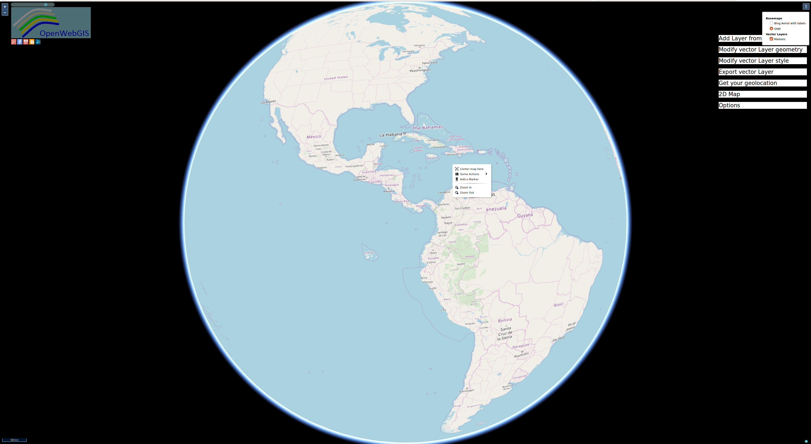

# OpenWebGIS2

OpenWebGIS ver. 2 is open source Geographic information system based on OpenLayers 3 [https://openlayers.org/], Cesium [https://cesium.com/] as an open-source JavaScript library for world-class 3D globes and maps; and OL-Cesium for OpenLayers - Cesium integration [https://openlayers.org/ol-cesium/].
 Online full functionality web version of OpenWebGIS2 is at http://opengis.dlinkddns.com/gis/openwebgis2/opengis_en.html.
